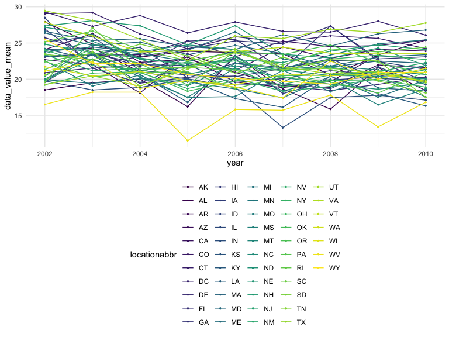
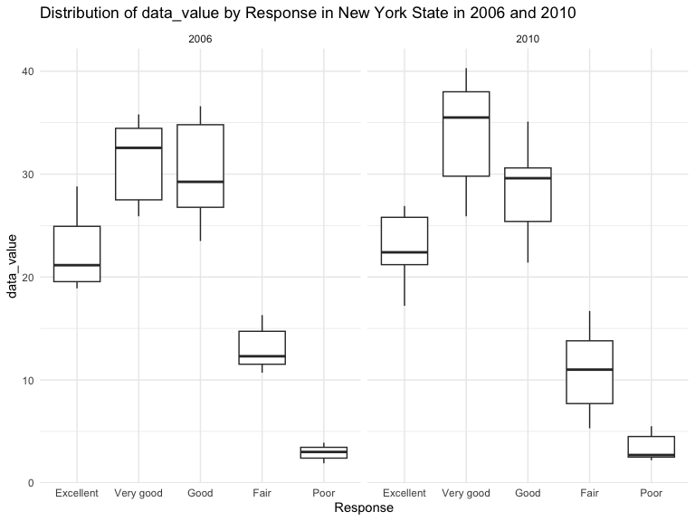
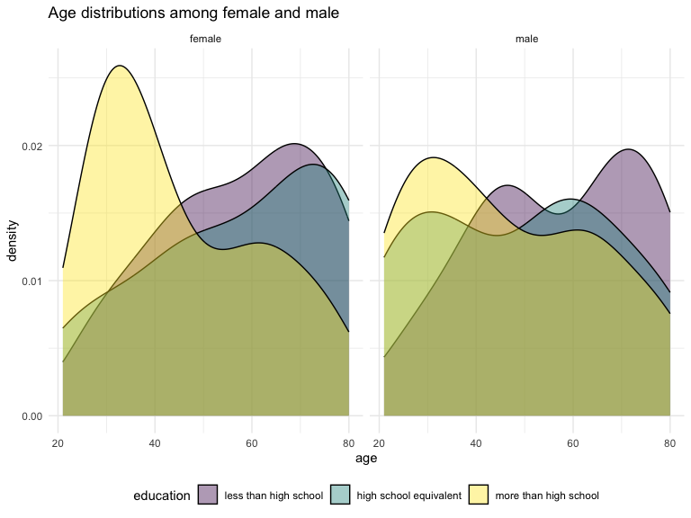
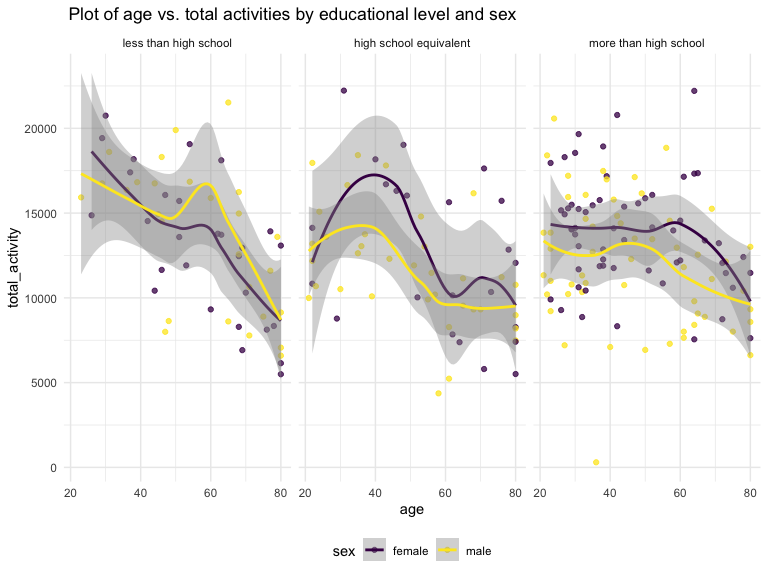
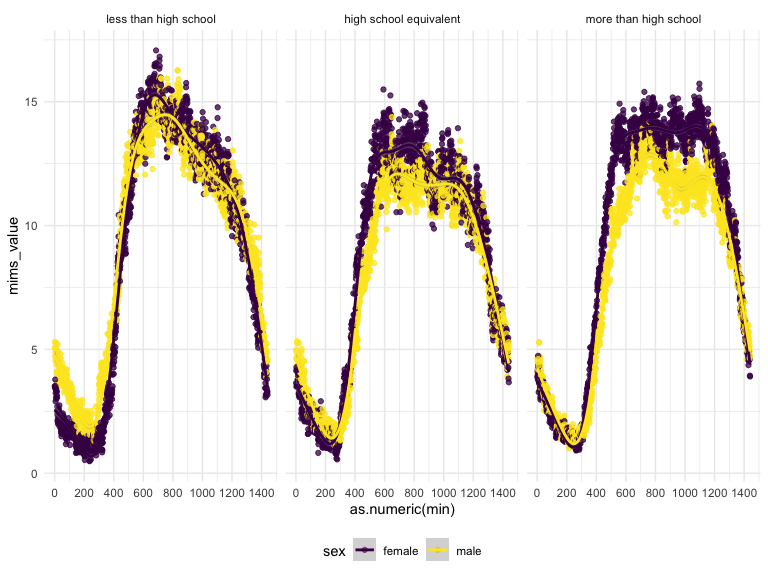

p8105_hw3_yl5219
================
Yuqing Liu
2023-10-14

### Problem 1

#### read in data

``` r
library(p8105.datasets)
data("instacart")

instacart = 
  instacart |> 
  as_tibble()
```

- a short description of the dataset:

  - The dataset contains 1384617 rows and 15 columns, with each row
    resprenting a single product from an instacart order.
  - Variables include identifiers for user, order, and product; the
    order in which each product was added to the cart. There are several
    order-level variables, describing the day and time of the order, and
    number of days since prior order. Then there are several
    item-specific variables, describing the product name (e.g. Yogurt,
    Avocado), department (e.g. dairy and eggs, produce), and aisle
    (e.g. yogurt, fresh fruits), and whether the item has been ordered
    by this user in the past.
  - In total, there are 39123 products found in 131209 orders from
    131209 distinct users.

- How many aisles are there, and which aisles are the most items ordered
  from?

In total, there are 134 aisles, with fresh vegetables and fresh fruits
holding the most items ordered by far.

``` r
instacart |> 
  count(aisle) |> 
  arrange(desc(n))
```

    ## # A tibble: 134 × 2
    ##    aisle                              n
    ##    <chr>                          <int>
    ##  1 fresh vegetables              150609
    ##  2 fresh fruits                  150473
    ##  3 packaged vegetables fruits     78493
    ##  4 yogurt                         55240
    ##  5 packaged cheese                41699
    ##  6 water seltzer sparkling water  36617
    ##  7 milk                           32644
    ##  8 chips pretzels                 31269
    ##  9 soy lactosefree                26240
    ## 10 bread                          23635
    ## # ℹ 124 more rows

- Make a plot that shows the number of items ordered in each aisle,
  limiting this to aisles with more than 10000 items ordered. Arrange
  aisles sensibly, and organize your plot so others can read it.

``` r
instacart |> 
  count(aisle) |> 
  filter(n > 10000) |> 
  mutate(aisle = fct_reorder(aisle, n)) |> 
  ggplot(aes(x = aisle, y = n)) + 
  geom_point() + 
  labs(title = "Number of items ordered in each aisle") +
  theme(axis.text.x = element_text(angle = 60, hjust = 1))
```


- Make a table showing the three most popular items in each of the
  aisles “baking ingredients”, “dog food care”, and “packaged vegetables
  fruits”. Include the number of times each item is ordered in your
  table.

``` r
instacart |> 
  filter(aisle %in% c("baking ingredients", "dog food care", "packaged vegetables fruits")) |>
  group_by(aisle) |> 
  count(product_name) |> 
  mutate(rank = min_rank(desc(n))) |> 
  filter(rank < 4) |> 
  arrange(desc(n)) |>
  knitr::kable()
```

| aisle                      | product_name                                  |    n | rank |
|:---------------------------|:----------------------------------------------|-----:|-----:|
| packaged vegetables fruits | Organic Baby Spinach                          | 9784 |    1 |
| packaged vegetables fruits | Organic Raspberries                           | 5546 |    2 |
| packaged vegetables fruits | Organic Blueberries                           | 4966 |    3 |
| baking ingredients         | Light Brown Sugar                             |  499 |    1 |
| baking ingredients         | Pure Baking Soda                              |  387 |    2 |
| baking ingredients         | Cane Sugar                                    |  336 |    3 |
| dog food care              | Snack Sticks Chicken & Rice Recipe Dog Treats |   30 |    1 |
| dog food care              | Organix Chicken & Brown Rice Recipe           |   28 |    2 |
| dog food care              | Small Dog Biscuits                            |   26 |    3 |

- Make a table showing the mean hour of the day at which Pink Lady
  Apples and Coffee Ice Cream are ordered on each day of the week;
  format this table for human readers (i.e. produce a 2 x 7 table).

``` r
instacart |>
  filter(product_name %in% c("Pink Lady Apples", "Coffee Ice Cream")) |>
  group_by(product_name, order_dow) |>
  summarize(mean_hour = mean(order_hour_of_day)) |>
  pivot_wider(
    names_from = order_dow, 
    values_from = mean_hour) |>
  knitr::kable(digits = 2)
```

    ## `summarise()` has grouped output by 'product_name'. You can override using the
    ## `.groups` argument.

| product_name     |     0 |     1 |     2 |     3 |     4 |     5 |     6 |
|:-----------------|------:|------:|------:|------:|------:|------:|------:|
| Coffee Ice Cream | 13.77 | 14.32 | 15.38 | 15.32 | 15.22 | 12.26 | 13.83 |
| Pink Lady Apples | 13.44 | 11.36 | 11.70 | 14.25 | 11.55 | 12.78 | 11.94 |

### Problem 2

``` r
library(p8105.datasets)
data("brfss_smart2010")

brfss_smart2010
```

    ## # A tibble: 134,203 × 23
    ##     Year Locationabbr Locationdesc     Class Topic Question Response Sample_Size
    ##    <int> <chr>        <chr>            <chr> <chr> <chr>    <chr>          <int>
    ##  1  2010 AL           AL - Jefferson … Heal… Over… How is … Excelle…          94
    ##  2  2010 AL           AL - Jefferson … Heal… Over… How is … Very go…         148
    ##  3  2010 AL           AL - Jefferson … Heal… Over… How is … Good             208
    ##  4  2010 AL           AL - Jefferson … Heal… Over… How is … Fair             107
    ##  5  2010 AL           AL - Jefferson … Heal… Over… How is … Poor              45
    ##  6  2010 AL           AL - Jefferson … Heal… Fair… Health … Good or…         450
    ##  7  2010 AL           AL - Jefferson … Heal… Fair… Health … Fair or…         152
    ##  8  2010 AL           AL - Jefferson … Heal… Heal… Do you … Yes              524
    ##  9  2010 AL           AL - Jefferson … Heal… Heal… Do you … No                77
    ## 10  2010 AL           AL - Jefferson … Heal… Unde… Adults … Yes              316
    ## # ℹ 134,193 more rows
    ## # ℹ 15 more variables: Data_value <dbl>, Confidence_limit_Low <dbl>,
    ## #   Confidence_limit_High <dbl>, Display_order <int>, Data_value_unit <chr>,
    ## #   Data_value_type <chr>, Data_Value_Footnote_Symbol <chr>,
    ## #   Data_Value_Footnote <chr>, DataSource <chr>, ClassId <chr>, TopicId <chr>,
    ## #   LocationID <chr>, QuestionID <chr>, RESPID <chr>, GeoLocation <chr>

First, do some data cleaning:

- format the data to use appropriate variable names by
  `janitor::clean_names()`;
- focus on the “Overall Health” topic by
  `filter(topic == "Overall Health")`
- include only responses from “Excellent” to “Poor” by
  `filter(response %in% c("Excellent", "Very good", "Good", "Fair", "Poor"))`
- organize responses as a factor taking levels ordered from “Poor” to
  “Excellent” by `factor()` function

``` r
brfss_smart2010 = brfss_smart2010 |> 
  as_tibble()|>
  janitor::clean_names()|>
  filter(topic == "Overall Health")|> 
  filter(response %in% c("Excellent", "Very good", "Good", "Fair", "Poor"))|>
  mutate(response = factor(response, levels = c("Excellent", "Very good", "Good", "Fair", "Poor")))

brfss_smart2010
```

    ## # A tibble: 10,625 × 23
    ##     year locationabbr locationdesc     class topic question response sample_size
    ##    <int> <chr>        <chr>            <chr> <chr> <chr>    <fct>          <int>
    ##  1  2010 AL           AL - Jefferson … Heal… Over… How is … Excelle…          94
    ##  2  2010 AL           AL - Jefferson … Heal… Over… How is … Very go…         148
    ##  3  2010 AL           AL - Jefferson … Heal… Over… How is … Good             208
    ##  4  2010 AL           AL - Jefferson … Heal… Over… How is … Fair             107
    ##  5  2010 AL           AL - Jefferson … Heal… Over… How is … Poor              45
    ##  6  2010 AL           AL - Mobile Cou… Heal… Over… How is … Excelle…          91
    ##  7  2010 AL           AL - Mobile Cou… Heal… Over… How is … Very go…         177
    ##  8  2010 AL           AL - Mobile Cou… Heal… Over… How is … Good             224
    ##  9  2010 AL           AL - Mobile Cou… Heal… Over… How is … Fair             120
    ## 10  2010 AL           AL - Mobile Cou… Heal… Over… How is … Poor              66
    ## # ℹ 10,615 more rows
    ## # ℹ 15 more variables: data_value <dbl>, confidence_limit_low <dbl>,
    ## #   confidence_limit_high <dbl>, display_order <int>, data_value_unit <chr>,
    ## #   data_value_type <chr>, data_value_footnote_symbol <chr>,
    ## #   data_value_footnote <chr>, data_source <chr>, class_id <chr>,
    ## #   topic_id <chr>, location_id <chr>, question_id <chr>, respid <chr>,
    ## #   geo_location <chr>

Using this dataset, do or answer the following (commenting on the
results of each):

- In 2002, which states were observed at 7 or more locations? What about
  in 2010?

``` r
brfss_smart2010|>
  filter(year == 2002)|>
  group_by(locationabbr)|>
  summarize(n = n_distinct(locationdesc))|>
  filter(n>=7)
```

    ## # A tibble: 6 × 2
    ##   locationabbr     n
    ##   <chr>        <int>
    ## 1 CT               7
    ## 2 FL               7
    ## 3 MA               8
    ## 4 NC               7
    ## 5 NJ               8
    ## 6 PA              10

In 2002, CT(Connecticut), FL(Florida), MA(Massachusetts), NC(North
Carolina), NJ(New Jersey), PA(Pennsylvania) states were observed at 7 or
more locations.

``` r
brfss_smart2010|>
  filter(year == 2010)|>
  group_by(locationabbr)|>
  summarize(n = n_distinct(locationdesc))|>
  filter(n>=7)
```

    ## # A tibble: 14 × 2
    ##    locationabbr     n
    ##    <chr>        <int>
    ##  1 CA              12
    ##  2 CO               7
    ##  3 FL              41
    ##  4 MA               9
    ##  5 MD              12
    ##  6 NC              12
    ##  7 NE              10
    ##  8 NJ              19
    ##  9 NY               9
    ## 10 OH               8
    ## 11 PA               7
    ## 12 SC               7
    ## 13 TX              16
    ## 14 WA              10

In 2002, CA(California), CO(Colorado), FL(Florida), MA(Massachusetts),
MD(Maryland), NC(North Carolina), NE(Nevada), NJ(New Jersey), NY(New
York), OH(Ohio) states were observed at 7 or more locations.

- Construct a dataset that is limited to Excellent responses, and
  contains, year, state, and a variable that averages the data_value
  across locations within a state. Make a “spaghetti” plot of this
  average value over time within a state (that is, make a plot showing a
  line for each state across years – the geom_line geometry and group
  aesthetic will help).

``` r
df = brfss_smart2010|>
  filter(response == "Excellent")|>
  group_by(year, locationabbr)|>
  summarize(data_value_mean=mean(data_value, na.rm = TRUE))
```

    ## `summarise()` has grouped output by 'year'. You can override using the
    ## `.groups` argument.

``` r
df
```

    ## # A tibble: 443 × 3
    ## # Groups:   year [9]
    ##     year locationabbr data_value_mean
    ##    <int> <chr>                  <dbl>
    ##  1  2002 AK                      27.9
    ##  2  2002 AL                      18.5
    ##  3  2002 AR                      24.1
    ##  4  2002 AZ                      24.1
    ##  5  2002 CA                      22.7
    ##  6  2002 CO                      23.1
    ##  7  2002 CT                      29.1
    ##  8  2002 DC                      29.3
    ##  9  2002 DE                      20.9
    ## 10  2002 FL                      25.7
    ## # ℹ 433 more rows

``` r
df |> 
  ggplot(aes(x = year, y = data_value_mean, group = locationabbr, color = locationabbr)) +
  geom_line() + geom_point(size = 0.5)
```



- Make a two-panel plot showing, for the years 2006, and 2010,
  distribution of data_value for responses (“Poor” to “Excellent”) among
  locations in NY State.

``` r
# Create a two-panel plot
brfss_smart2010 |>
  filter(locationabbr=="NY"& year %in% c(2006,2010))|>
  ggplot( aes(x = response, y = data_value)) +
  geom_boxplot() +
  facet_wrap(~year, ncol = 2) +
  labs(title = "Distribution of data_value by Response in New York State in 2006 and 2010",
       x = "Response",
       y = "data_value") +
  theme_minimal()
```



### Problem 3

- Load, tidy, merge, and otherwise organize the data sets. Your final
  dataset should include all originally observed variables; exclude
  participants less than 21 years of age, and those with missing
  demographic data; and encode data with reasonable variable classes
  (i.e. not numeric, and using factors with the ordering of tables and
  plots in mind).

  - load and tidy `nhanes_accel` dataset:
    - clean the variable names by `janitor::clean_names()`
    - convert the dataset into long format by `pivot longer`
    - select only the value of `min` variable by
      `separate(min, into = c("prefix", "min"), sep = 3)` and
      `select(-prefix)`

``` r
nhanes_accel = read.csv("./nhanes_accel.csv")|> 
  janitor::clean_names()|>
  pivot_longer(
    min1:min1440,
    names_to = "min",
    values_to = "mims_value"
  )|>
  separate(min, into = c("prefix", "min"), sep = 3)|>
  select(-prefix)

nhanes_accel
```

    ## # A tibble: 360,000 × 3
    ##     seqn min   mims_value
    ##    <int> <chr>      <dbl>
    ##  1 62161 1          1.11 
    ##  2 62161 2          3.12 
    ##  3 62161 3          1.47 
    ##  4 62161 4          0.938
    ##  5 62161 5          1.60 
    ##  6 62161 6          0.145
    ##  7 62161 7          2.10 
    ##  8 62161 8          0.509
    ##  9 62161 9          1.63 
    ## 10 62161 10         1.20 
    ## # ℹ 359,990 more rows

- load and tidy `nhanes_covar` dataset:
  - clean the variable names by `janitor::clean_names()`
  - exclude participants less than 21 years of age by
    `filter(age >= 21)`
  - excluse those with missing demographic data by `drop_na()`
  - encode `education` and `sex` with reasonable variable classes by
    mutating `education` and `sex` with corresponding class names by
    `case_match()`

``` r
nhanes_covar = read.csv("./nhanes_covar.csv", skip = 4)|>
  janitor::clean_names()|>
  as_tibble()|>
  filter(age >= 21)|>
  drop_na()|>
  mutate(education = case_match(education, 
                                1 ~ "less than high school",
                                2 ~ "high school equivalent",
                                3 ~ "more than high school"))|>
  mutate(sex = case_match(sex, 
                                1 ~ "male",
                                2 ~ "female"))

nhanes_covar
```

    ## # A tibble: 228 × 5
    ##     seqn sex      age   bmi education             
    ##    <int> <chr>  <int> <dbl> <chr>                 
    ##  1 62161 male      22  23.3 high school equivalent
    ##  2 62164 female    44  23.2 more than high school 
    ##  3 62169 male      21  20.1 high school equivalent
    ##  4 62174 male      80  33.9 more than high school 
    ##  5 62177 male      51  20.1 high school equivalent
    ##  6 62178 male      80  28.5 high school equivalent
    ##  7 62180 male      35  27.9 more than high school 
    ##  8 62184 male      26  22.1 high school equivalent
    ##  9 62189 female    30  22.4 more than high school 
    ## 10 62199 male      57  28   more than high school 
    ## # ℹ 218 more rows

- merge `nhanes_accel` and `nhanes_covar` dataset together:

``` r
nhanes = inner_join(nhanes_accel, nhanes_covar, by = "seqn")
nhanes
```

    ## # A tibble: 328,320 × 7
    ##     seqn min   mims_value sex     age   bmi education             
    ##    <int> <chr>      <dbl> <chr> <int> <dbl> <chr>                 
    ##  1 62161 1          1.11  male     22  23.3 high school equivalent
    ##  2 62161 2          3.12  male     22  23.3 high school equivalent
    ##  3 62161 3          1.47  male     22  23.3 high school equivalent
    ##  4 62161 4          0.938 male     22  23.3 high school equivalent
    ##  5 62161 5          1.60  male     22  23.3 high school equivalent
    ##  6 62161 6          0.145 male     22  23.3 high school equivalent
    ##  7 62161 7          2.10  male     22  23.3 high school equivalent
    ##  8 62161 8          0.509 male     22  23.3 high school equivalent
    ##  9 62161 9          1.63  male     22  23.3 high school equivalent
    ## 10 62161 10         1.20  male     22  23.3 high school equivalent
    ## # ℹ 328,310 more rows

- Produce a reader-friendly table for the number of men and women in
  each education category

``` r
nhanes|>
  group_by(sex, education)|>
  summarize(n_obs = n_distinct(seqn), .groups = "drop")|>
  pivot_wider(names_from = education, values_from = n_obs)|>
  knitr::kable()
```

| sex    | high school equivalent | less than high school | more than high school |
|:-------|-----------------------:|----------------------:|----------------------:|
| female |                     23 |                    28 |                    59 |
| male   |                     35 |                    27 |                    56 |

**Comment:**

- Among the total 110 female participants, 23 of them have educational
  level of high school equivalent, 28 have less than high school and 59
  have more than high school.

- Among the total 118 female participants, 35 of them have educational
  level of high school equivalent, 27 have less than high school and 56
  have more than high school.  

- Almost half of the participants have educational level of more than
  high school in both female (59 out of 110) and male (56 out of 118)
  subgroups.

- In high school equivalent stratum, there is relatively more male than
  female (35 vs. 23).

- The numbers of female and male in each category are similar in less
  than high school stratum (28 vs. 27) and more than high school stratum
  (59 vs. 56).

- create a visualization of the age distributions for men and women in
  each education category.

``` r
nhanes|>
  group_by(sex, education)|>
  distinct(seqn,sex,age,education)|>
  ggplot(aes(x = age, fill = education)) + 
  labs(title = "Age distributions among female and male") +
  geom_density(alpha = .4) +
  facet_grid(~sex)+ 
  viridis::scale_fill_viridis(discrete = TRUE)
```



**Comment:**

- The educational level of **more than high school** has a right-skewed
  shape of age distribution both among female (with a peak at
  approximately 32) and male (with a peak at approximately 31).

- The educational level of **less than high school** and **high school
  equivalent** have a left-skewed shape of age distribution among
  female, with a peak at approximately 70 and 72 respectively.

- The educational level of **less than high school** (peaks at 35
  and 71) and **high school equivalent** (peaks at 30 and 59) have a
  bi-modal shape of age distribution among male.

- We can see that the disparity in the distribution of education levels
  among females is notably more pronounced than that observed in the
  male group. This suggests that gender may indeed influence educational
  attainment, with females exhibiting a larger variation in age across
  different education levels (ie., among female, participants with
  educational level of more than high school are more likely to be
  younger, and participants with educational level of less than high
  school and high school equivalent are more likely to be older).

- Traditional analyses of accelerometer data focus on the total activity
  over the day. Using your tidied dataset, aggregate across minutes to
  create a total activity variable for each participant.

  - create a variable `total_activity`:
    - aggregate activity variable across minutes by
      `summarise(total_activity=sum(mims_value))`

``` r
total_activity = nhanes|>
  group_by(seqn,sex,age,education)|>
  summarize(total_activity=sum(mims_value),.groups = "drop")
  
total_activity
```

    ## # A tibble: 228 × 5
    ##     seqn sex      age education              total_activity
    ##    <int> <chr>  <int> <chr>                           <dbl>
    ##  1 62161 male      22 high school equivalent         13194.
    ##  2 62164 female    44 more than high school          13411.
    ##  3 62169 male      21 high school equivalent          9991.
    ##  4 62174 male      80 more than high school           8579.
    ##  5 62177 male      51 high school equivalent         11918.
    ##  6 62178 male      80 high school equivalent          7489.
    ##  7 62180 male      35 more than high school          14205.
    ##  8 62184 male      26 high school equivalent         13599.
    ##  9 62189 female    30 more than high school          18551.
    ## 10 62199 male      57 more than high school          14548.
    ## # ℹ 218 more rows

- plot total activities (y-axis) against age (x-axis):
  - create a plot of `age` vs. `total_activity` and compare men to women
    by
    `ggplot(aes(x = age, y = total_activity, group = sex, color = sex))`
  - add points by `geom_point()`
  - add a smooth by `geom_smooth()`
  - separate panels for each education level by `facet_grid(~education)`

``` r
total_activity |>
  ggplot(aes(x = age, y = total_activity, group = sex, color = sex)) + 
  geom_point(alpha= 0.75) +
  geom_smooth() +
  facet_grid(~education) +
  labs(title = " Plot of age vs. total activities by educational level and sex") 
```



**Comment:**

- In general, young females and young males exhibit higher levels of
  total activity across all education groups.

- Specifically, within the ‘High school equivalent’ and ‘More than high
  school’ education groups, total activity levels are slightly higher
  for females compared to males.

- However, given the considerable overlap in confidence intervals
  between females and males across all education groups, there is no
  statistically significant difference in total activity between the
  genders within these education categories.

- Additionally, both females and males within the ‘More than high
  school’ education category display less variability in total activity
  across age groups, in contrast to the other two education categories.

<break>

- Make a three-panel plot that shows the 24-hour activity time courses
  for each education level and use color to indicate sex. Describe in
  words any patterns or conclusions you can make based:

  - create a plot of `mims_value` activity across 24-hour `min` and
    compare men to women by
    `ggplot(aes(x = min, y = mims_value, group = sex, color = sex))`
  - add points by `geom_point()`
  - add a smooth by `geom_smooth()`
  - separate panels for each education level by `facet_grid(~education)`

``` r
nhanes |>
  group_by(min, sex, education)|>
  summarize(mims_value = sum(mims_value), .groups = "drop")|>
  ggplot(aes(x = min, y = mims_value, group = sex, color = sex)) +
  geom_point(alpha =0.75, size = 1.5) + geom_smooth()+
  facet_grid(~education)
```



**Comment**

- Both females and males tend to exhibit higher MIMS values between 8:30
  and 20:00 (equivalent to 510 to 1200 minutes) across all education
  groups.

- The MIMS values show a significant increase starting at 4:00, reaching
  their peak around 8:30, followed by a gradual decrease from 8:30 to
  20:00 and a sharp drop after 20:00.

- Within the ‘Less than high school’ education category, both females
  and males tend to have higher peak MIMS values compared to the other
  two education categories. This suggests a potential association
  between educational attainment and differences in peak MIMS values,
  with lower education levels potentially correlating with higher peak
  MIMS scores.

- Conversely, in the ‘High school equivalent’ and ‘More than high
  school’ education categories, females tend to exhibit higher MIMS
  values than males between 8:30 and 20:00, while MIMS values are
  similar between genders in the ‘Less than high school’ education
  category.
